# Tutorial: Build a web app with Django & Replit

In this tutorial, we'll create a basic Django app in Replit that displays the weather for the user's location, based on their IP address. See a completed version of this in Replit at [https://replit.com/@lizkrznarich/Python2WeatherAppFinished](https://replit.com/@lizkrznarich/Python2WeatherAppFinished)

1. [Django project setup](#django-project-setup)
2. [Create homepage templates](#create-homepage-templates)
3. [Create homepage view & configure URL](#create-homepage-view--configure-url)
4. [Get the user's IP address](#get-the-users-ip-address)
5. [Get the user's location](#get-the-users-location)
6. [Configure OpenWeather API key](#configure-openweather-api-key)
7. [Get the current weather for the user's location](#get-weather-data-for-the-users-location)
8. [Add CSS stylesheets](#add-css-stylesheets)
9. [Add a chart with Plotly](#add-a-chart-with-plotly)
10. [Bonus activity: Add weather icons](#bonus-activity-add-weather-icons)

# Django project setup

Before we can get started, we first need to set up a new Django project in Replit.

1. Sign into your Replit account at [replit.com](https://replit.com). If you don't have an account, create a new one.

2. In Replit, click the **+ Create** button. In the window that opens, type **django** in the Template field and choose the **django replit** option from the dropdown. Optionally, add a custom title in the Title field and click **+ Create Repl**

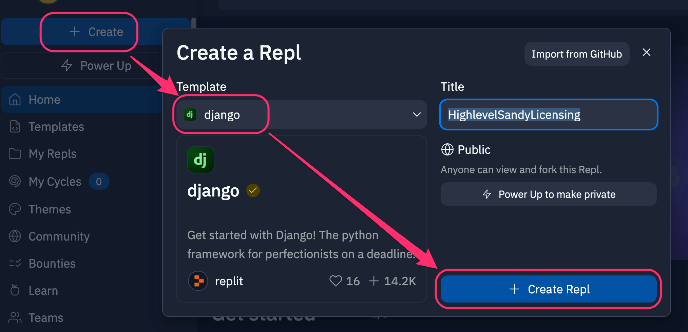

3. The basic Django file structure will appear in the **Files** panel at left. Click **README.MD** to see the instructions for getting Django up and running.

4. Per **README.MD**, open the **Shell** tab in the right panel and run the following command to generate a secret key.

        python
        import secrets
        secrets.token_urlsafe(32)

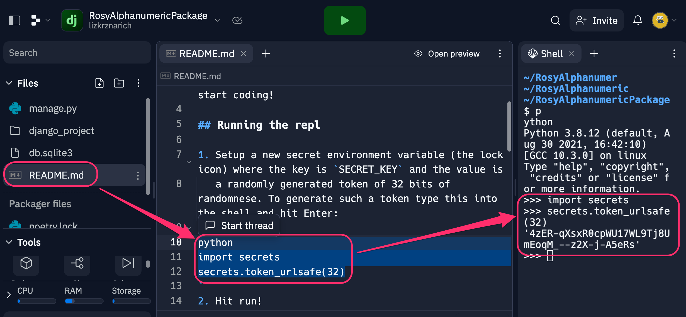

5. Copy the generated key, then click the **Secrets** icon in the **Tools** section of the left panel. In the **Secrets** tab that opens in the right panel, type **SECRET_KEY** in the **key** field, paste the generated key in the **value** field, and **Click Add new secret**.

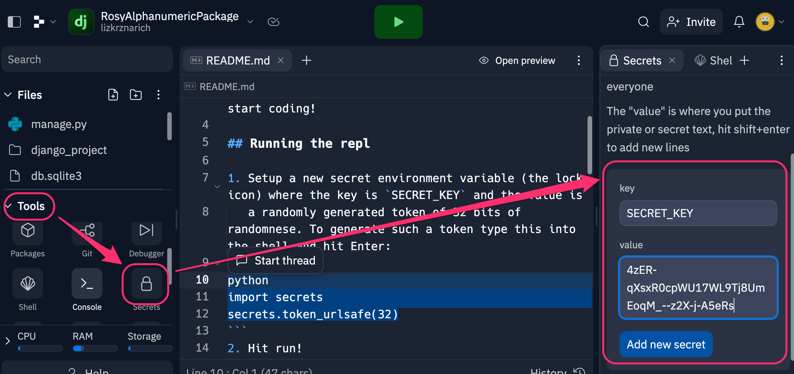

6. Click the green **Run** button. Once Django has started, a page with the message "The install worked successfully! Congratulations!" should appear in the **Webview** tab at right. This is your Django app! Click Open in new tab to view it in full screen.

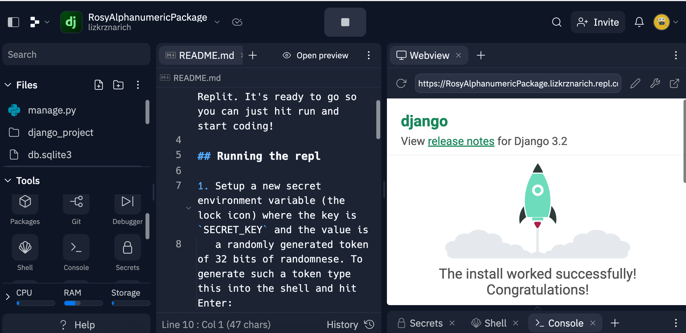


# Create homepage templates

In this section, we'll add HTML templates for our homepage and configure Django to look for our templates in the correct directory. Django includes its own [template system](https://docs.djangoproject.com/en/4.1/topics/templates). Components of the template system include:

- [Variables](https://docs.djangoproject.com/en/4.1/topics/templates/#variables) allow passing data from our Python code into templates. Data is passed in a dictionary, and template variables enclosed in ```{{ }}```
- [Tags](https://docs.djangoproject.com/en/4.1/topics/templates/#tags) allow adding various bits of logic to your templates. Django includes a large [library of built-in tags](https://docs.djangoproject.com/en/4.1/ref/templates/builtins/#ref-templates-builtins-tags). Tags are enclosed in ``````


1. In the **Files** panel, hover over **django_project**, click the 3 dots icon and choose **Add folder**.

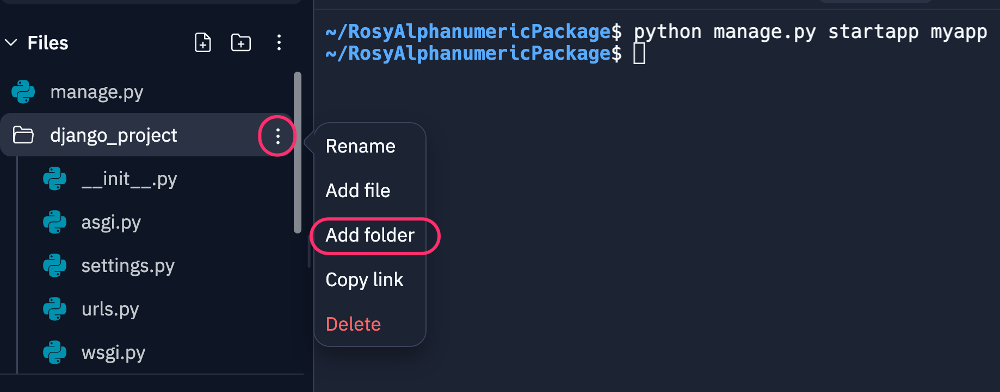

2. Type **templates** in the folder name box and press **Enter/Return** to create the folder.

3. Hover over **templates**, click the 3 dots icon and choose **Add file**.

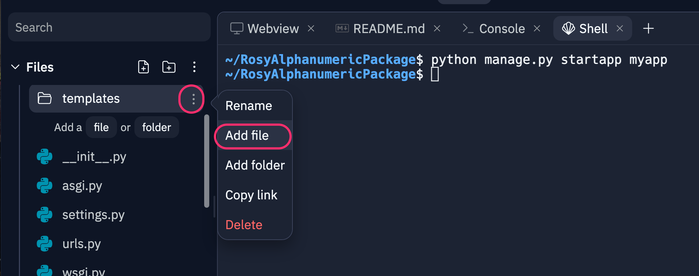

4. Type **base.html** in the file name box and press**Enter/Return** to create the file.

5. Copy the template code below and paste it into the **base.html** file. This will be the parent template for all of our other templates.

        <!DOCTYPE html>

        <html lang="en">
        <head>
            <meta charset="UTF-8">
            <title>Hello World!</title>
            <meta charset="UTF-8"/>
            <meta name="viewport" content="width=device-width, initial-scale=1"/>
        </head>
        <body>
            
        </body>
        </html>

6. Create another file inside **templates** named **index.html**. Copy the code below and paste it into the **index.html** file. The line between `````` and `````` will be inserted where `````` is located in the parent base.html template.

        

        
        <h1>Hello World!</h1>
        

7. We need to tell Django where to look for our template files. In the **Files** panel, click **settings.py** to open it. Scroll to the **TEMPLATES** section and replace the line that begins with **DIR** with the code below.

        'DIRS': [os.path.join(BASE_DIR, 'django_project', 'templates')],

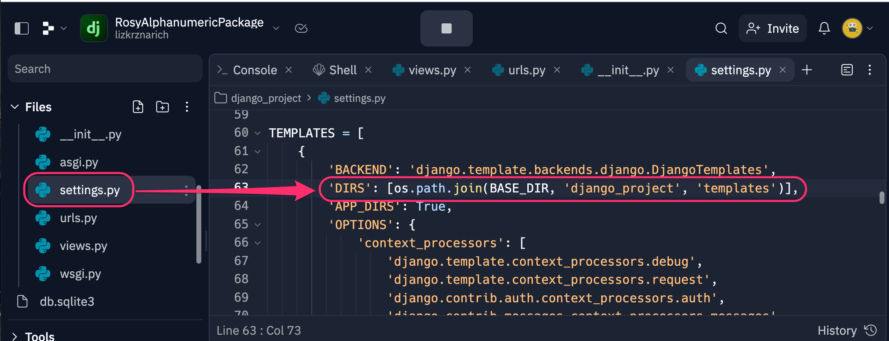

# Create homepage view & configure URL

In this section, we'll create a new view that points to the homepage template, and then configure a URL to point to the view.

7. Create a new file inside **django_project** named **views.py** and paste the code below to create a new view that directs to our index.html template.

        from django.shortcuts import render

        def index(request):
            return render(request, 'index.html')

8. Finally, we need to link our view to a URL. In the Files panel, click the **django_project** folder, then click **urls.py**. In the imports section add the line below.

        from . import views.py

9. Add the following line to the url_patterns list to configure a new URL pattern that points to our index view.

        path('', views.index, name='index'),

10. The complete urls.py should look like this:

        from django.contrib import admin
        from django.urls import path
        from . import views

        urlpatterns = [
            path('', views.index, name='index'),
            path('admin/', admin.site.urls),
        ]

11. Open the **Webview** tab (Tools > Webview). You should see a "Hello world!" message from your index template.

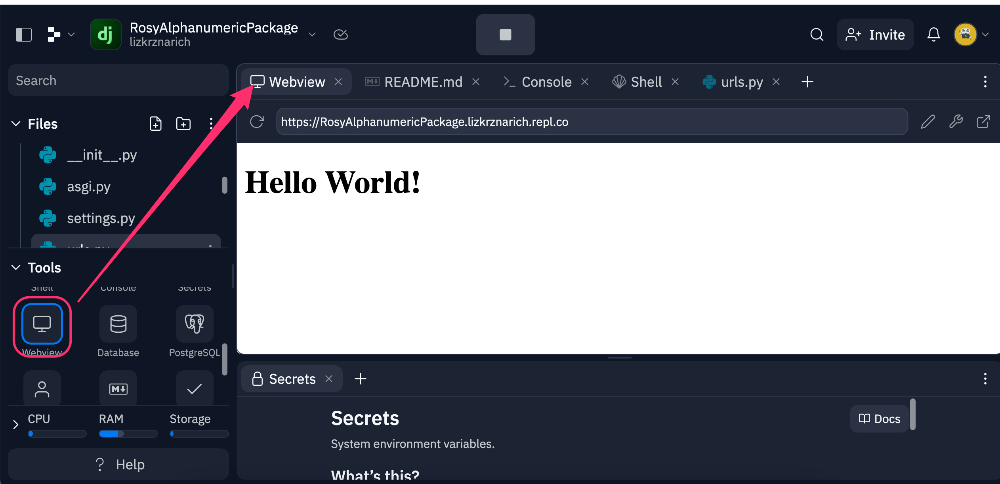

# Get the user's IP address

In order to get the user's location, we first need to get their IP address. An IP address identifies the device that a user's request is coming from.

1. Open **views.py** and update the **index(request)** function so that it gets the user's IP address from the built-in Django request object and passes it to the index.html template. The user's IP address can be located either in the ```HTTP_X_FORWARDED_FOR``` or ```REMOTE_ADDR``` request header, depending on their network configuration, so we need to check both headers.

        def index(request):
            x_forwarded_for = request.META.get('HTTP_X_FORWARDED_FOR')
            if x_forwarded_for:
                ip = x_forwarded_for.split(',')[0]
            else:
                ip = request.META.get('REMOTE_ADDR')
            return render(request, 'index.html', {'ip': ip})

2. Open the **index.html** template and add the line below Hello World.

        <p>You are visiting from IP address {{ ip }}</p>

3. Your page should now show the IP address you are visting from!

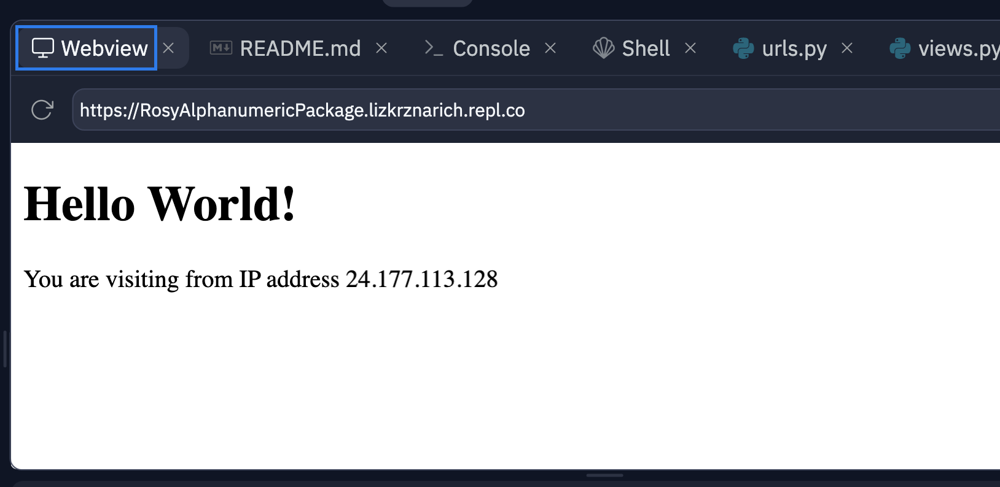

# Get the user's location

Now that we have the user's IP, we can get the geolocation information associated with that IP. We'll use [https://ip-api.com](https://ip-api.com) and the requests module for this. IP API is very simple - send a request in format http://ip-api.com/json/24.177.113.128, and it will return a JSON response with the corresponding location data:

        {"status":"success","country":"United States","countryCode":"US","region":"WI","regionName":"Wisconsin","city":"Madison","zip":"53705","lat":43.0725,"lon":-89.4491,"timezone":"America/Chicago","isp":"Charter Communications","org":"Spectrum","as":"AS20115 Charter Communications","query":"24.177.113.128"}

1. Open **views.py** and add the requests module to the list of imports.

        import requests

2. Add a new function to views.py that sends a requests to ip-api.com

        def get_location_from_ip(ip_address):
            response = requests.get("http://ip-api.com/json/" + ip_address)
            return response.json()

3. Call the new function from your **index(request)** function and assign the response to a variable, and pass that data to the template.

        def index(request):
            x_forwarded_for = request.META.get('HTTP_X_FORWARDED_FOR')
            if x_forwarded_for:
                ip = x_forwarded_for.split(',')[0]
            else:
                ip = request.META.get('REMOTE_ADDR')
            location = get_location_from_ip(ip)
            return render(request, 'index.html', {'ip': ip, 'location': location})

4. Add the user's location info to the **index.html** template by pasting the following line beneath "You are visiting from...".

        <p>You are located in {{ location }}</p>

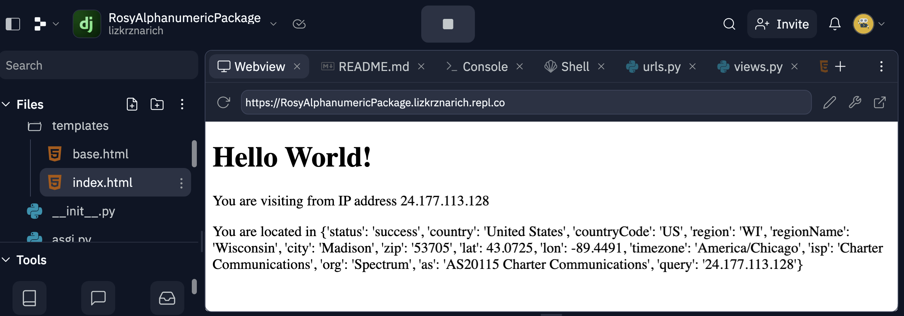

5. Oops! The raw response from ip-api.com doesn't look so nice. We can get individual values using the syntax below.

        <p>You are located in {{ location.city }}, {{ location.region }}, {{ location.country_Code }}</p>

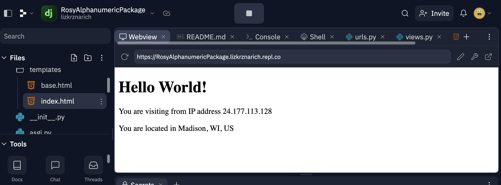


# Configure OpenWeather API key

We'll get weather data from [OpenWeather](https://openweathermap.org) using their [Current Weather API](https://openweathermap.org/current). To use this API, we first need to register for a key and configure that key in our Django settings file.

1. Register for an OpenWeather API key at [https://home.openweathermap.org/users/sign_up](https://home.openweathermap.org/users/sign_up). You do NOT need to tick the checkboxes to receive emails from OpenWeather.

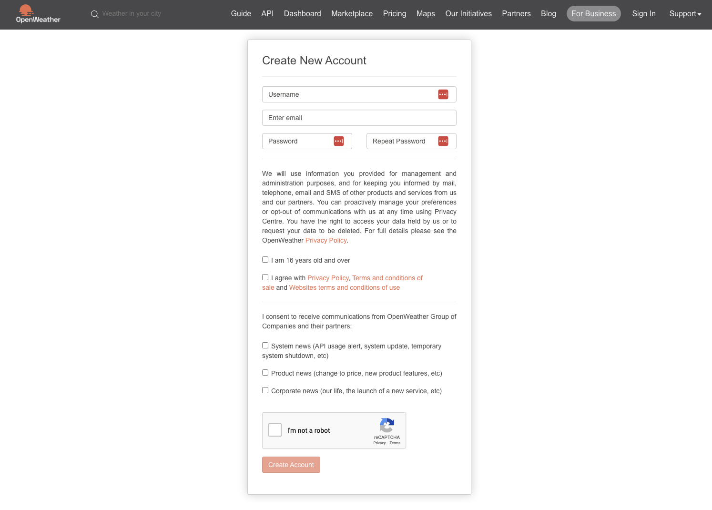

2. Visit the **API Keys** tab in your account and copy the value in the **Key** field. Note! It can take up to 2 hours for a new key to become active.

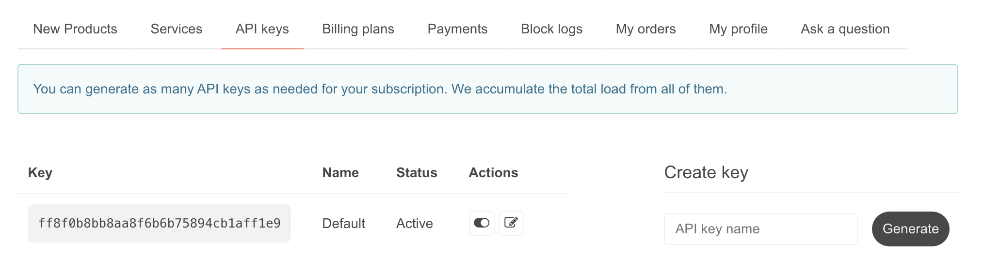

3. In Replit, click the **Secrets** icon in the **Tools** section of the left panel. In the **Secrets** tab that opens in the right panel, type **OPEN_WEATHER_KEY** in the **key** field, paste your OpenWeather API key in the **value** field, and **Click Add new secret**.

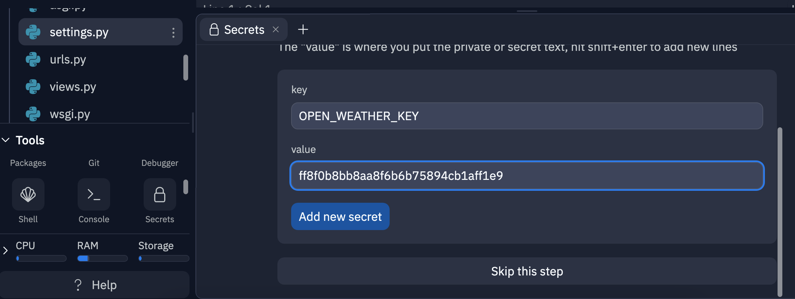

4. In the **Files** panel, click **settings.py** to open it. At the bottom of the file, add a new line with the code below.

        OPEN_WEATHER_KEY = os.getenv('OPEN_WEATHER_KEY')

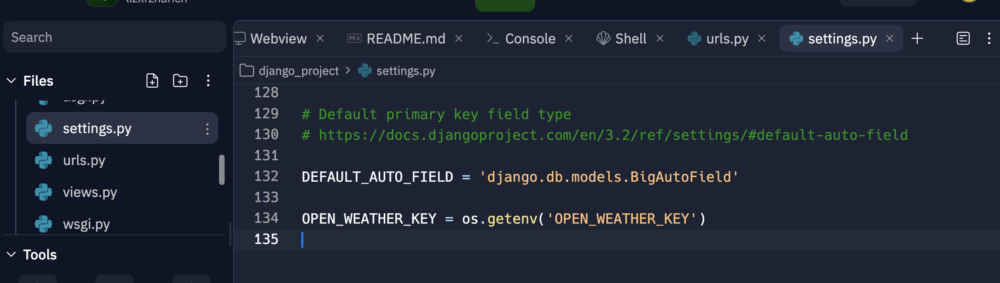

*Note: We could paste this key directly into our code, but that presents a security risk. If our code becomes public (either on purpose or accidentally), others could use our key maliciously. Keys should be treated like passwords, they should never be placed directly in code.*

# Get weather data for the user's location

Now that we have the user's location and our OpenWeather API key, we can get the current weather for that location using a request in the format ```https://api.openweathermap.org/data/2.5/weather?lat={lat}&lon={lon}&appid={API key}&units=imperial```.

1. Open **views.py** and import the settings file. This is how we share values between files in Python!

        from . import settings

3. Open **views.py** and add a new function that sends a requests to api.openweathermap.org

        def get_weather_from_location(location):
            token = os.environ.get("OPEN_WEATHER_TOKEN")
            url = "https://api.openweathermap.org/data/2.5/weather?lat=" + location['lat'] + "&lon=" + location['lat'] + "&units=imperial&appid=" + settings.OPEN_WEATHER_KEY
            response = requests.get(url)
            return response.json()

*Note: the url above is a very long string. We can use Pythons built-in string method [.format()](https://docs.python.org/3/library/stdtypes.html#str.format) to shorten it a bit. In place of each ```{}``` in the string, Python will substitute an argument passed to .formt(), in order from left to right.*

        url = "https://api.openweathermap.org/data/2.5/weather?lat={}&lon={}&units=imperial&appid={}".format(location['lat'], location['lon'], settings.OPEN_WEATHER_KEY)

4. Call the new function from your **index(request)** function and assign the response to a variable, and pass that data to the template.

        def index(request):
            x_forwarded_for = request.META.get('HTTP_X_FORWARDED_FOR')
            if x_forwarded_for:
                ip = x_forwarded_for.split(',')[0]
            else:
                ip = request.META.get('REMOTE_ADDR')
            location = get_location_from_ip(ip)
            weather = get_weather_from_location(location)
            return render(request, 'index.html', {'ip': ip, 'location': location, 'weather': weather})

5. Add the weather info for the user's location to the **index.html** template by pasting the following line beneath "You are located in...".

        <p>Current weather: {{ weather }}</p>

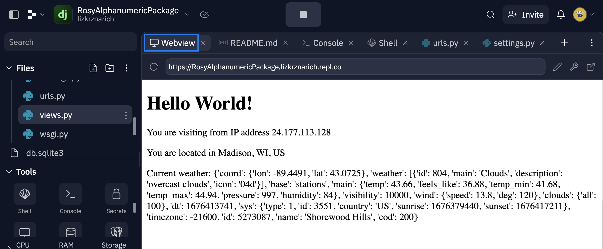

6. Like with location, ```weather``` contains the entire OpenWeather JSON response. We can make things prettier by displaying just specific values. Update the "Current weather" line in **index.html** with the code below.

        <p>Current weather:</p>
        <table>
            <tr><td>Temperature</td><td>{{ weather.main.temp }} F</td></tr>
            <tr><td>Wind</td><td>{{ weather.wind.speed }} mph</td></tr>
            <tr><td>Conditions</td><td>{{ weather.weather.0.description }}</td></tr>
        </table>

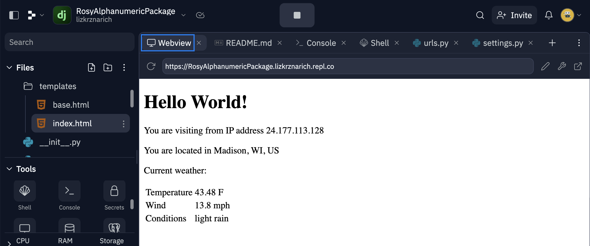

# Add CSS stylesheets

Our app works great, but it doesn't look so good. We'll add some basic styles using the [Twitter Bootstrap framework](https://getbootstrap.com/), then customize it with a local CSS stylesheet.

1. Add the Twitter Bootstrap CSS file to your templates by pasting the code below into **base.html**, inside the ```<head></head>``` tags.

        <link rel="stylesheet" href="https://cdn.jsdelivr.net/npm/bootstrap@5.2.3/dist/css/bootstrap.min.css" integrity="sha384-rbsA2VBKQhggwzxH7pPCaAqO46MgnOM80zW1RWuH61DGLwZJEdK2Kadq2F9CUG65" crossorigin="anonymous">

2. We won't cover Bootstrap in depth here, but we can borrow some formatting from the [Bootstrap example file](https://github.com/twbs/examples/blob/main/starter/index.html#L48). Update your **index.html** file to add the div tags below.

        

        
        <div class="container my-5">
        <div class="col-lg-12 px-0 text-center">
            <h1>Current weather</h1>
            <p>You are visiting from IP address {{ ip }}</p>
            <p>You are located in {{ location.city }}, {{ location.region }}, {{ location.countryCode }}</p>
            <hr>
            <table width="100%">
                <tr><td>Temperature</td><td>{{ weather.main.temp }} F</td></tr>
                <tr><td>Wind</td><td>{{ weather.wind.speed }} mph</td></tr>
                <tr><td>Conditions</td><td>{{ weather.weather.0.description }}</td></tr>
            </table>
        </div>
        </div>
        

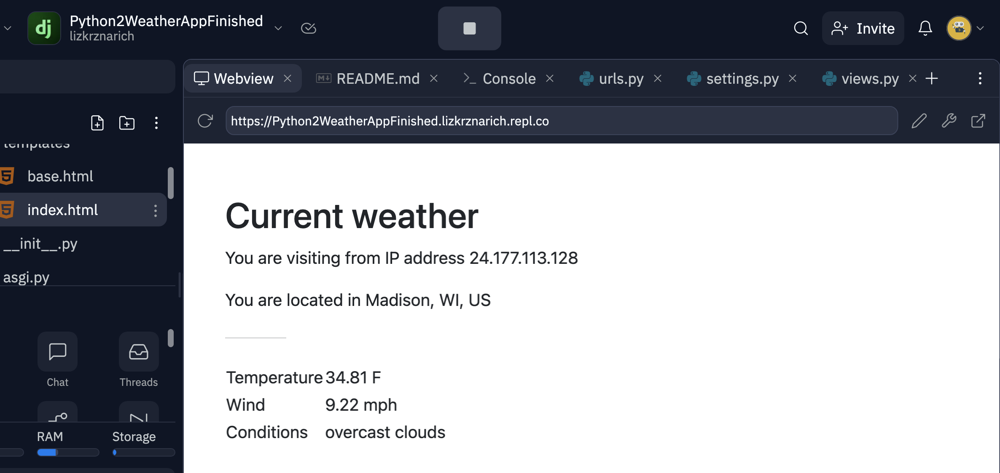

3. That's looking better already, but we can customize it further by adding our own CSS file. First, we need a folder to hold our static web assets, like CSS and images. In the **Files** panel, hover over **django_project**, click the 3 dots icon and choose **Add folder**.

4. Type **static** in the folder name box and press **Enter/Return** to create the folder. Important! Django is pre-configured to look for static assets in a folder named "static".

5. Create a new folder named **css** inside the **static** folder that you just created.

6. Hover over **css**, click the 3 dots icon and choose **Add file**.

7. Type **style.css** in the file name box and press**Enter/Return** to create the file.

8. Paste the code below into the **style.css** file.

        body {
            background-color: lightblue;
        }

        h1 {
            color: navy;
        }

        .container {
            background-color: white;
            border-radius: .5em;
            padding: 1em;
            width: 50%;
            margin-right: auto;
            margin-left: auto;
        }

9. Django knows that static assets should be in a folder named **static**, but we still need to tell Django where to look for the **static** folder. Open **settings.py**, look for the line with ```STATIC_URL = '/static/'``` and paste the code below on the next line.

        STATICFILES_DIRS = (os.path.join(BASE_DIR, 'django_project', 'static'), )

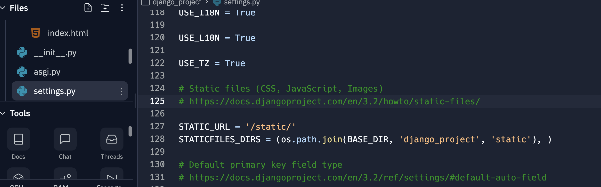

10. Finally, we need to add our CSS file to our templates. Open **base.html** and paste ````` at the top of the file. Paste the code below inside ```<head></head>```, on the line after the Boostrap CSS that we just added.

        <link rel="stylesheet" href="">

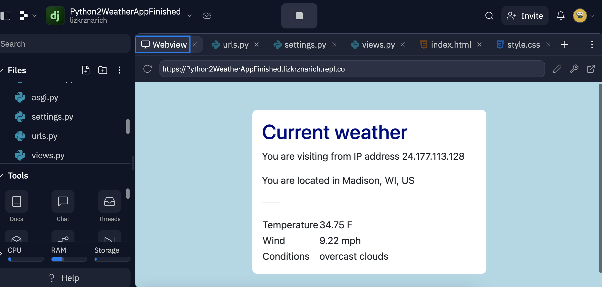

# Add a chart with Plotly

[Plotly](https://plotly.com) developes a "low code" framework called [DASH](https://dash.plotly.com/) that allows easily building graphs/charts and complete dashboards to visualize data. DASH, in turn, uses the Python Flask web app framework.

Plotly also makes its underlying code open source and publishes Python packages that allow you to create same types of charts/graphs in Python applications that don't use the full DASH framework.

There are several different ways to build data visualizations using [Plotly Python libraries](https://pypi.org/project/plotly). In this section, we'll use the [Plotly Graph Objects](https://plotly.com/python/graph-objects/) library to create a very simple bar chart using the temperature data returned by the OpenWeather API.

We're only touching the very tip of the Plotly iceberg here! For (much) more information, see [Plotly docs](https://plotly.com/pytho). Tutorials point also has a nice [tutorial about creating charts with Graph Objects](https://www.tutorialspoint.com/plotly/plotly_bar_and_pie_chart.htm).

1. To use Plotly, we first need to install it in our Replit environment. In the right sidebar, click **Packages**, search for Plotly in the window that opens, and click the **+** to install it.

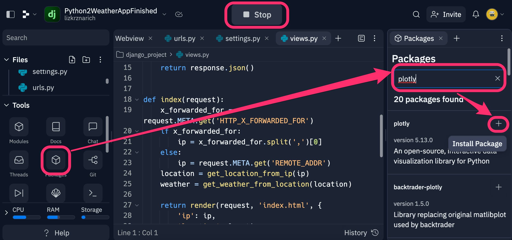

2. To make Django aware of our newly-installed package, we need to restart it. To restart, click the **Stop** button at the top of the screen, then click the **Run** button.

3. In your **views.py** file, add the following import statements beneath the existing imports.

        import plotly.graph_objs as go
        import plotly.io as pio

4. In **views.py**, add a new function that creates a bar chart with some hard-coded data by copying and pasting the code below. This functions returns the entire bar chart will be returned as HTML, which we can pass to our template.

        def get_chart():
            temp_types = ['High', 'Low', 'Feels like']
            temps = [35, 17, 23]
            data = [go.Bar(x=temp_types, y=temps)]
            fig = go.Figure(data=data)
            return pio.to_html(fig)

We use the [.Bar() method](https://plotly.com/python-api-reference/generated/plotly.graph_objects.Bar.html) of the plotly.graph_objects library to create a new bar chart data object and the [.Figure() method](https://plotly.com/python-api-reference/generated/plotly.graph_objects.Figure.html) to create the rendered figure. Finally, we use the [.to_html()](https://plotly.com/python-api-reference/generated/plotly.io.to_html.html) method of the plotly.io library to convert the rendered chart to HTML. These methods accept many more arguments that allow for customization - read the docs for details!

5. Update your **index()** function to call the **get_chart()** function and pass the returned chart to the template.

        def index(request):
            x_forwarded_for = request.META.get('HTTP_X_FORWARDED_FOR')
            if x_forwarded_for:
                ip = x_forwarded_for.split(',')[0]
            else:
                ip = request.META.get('REMOTE_ADDR')
            location = get_location_from_ip(ip)
            weather = get_weather_from_location(location)
            chart = get_chart()

            return render(request, 'index.html', {
                'ip': ip,
                'location': location,
                'weather': weather,
                'chart': chart
            })

6. In **index.html**, add the lines below beneath the closing ```</table>``` tag to display the chart. By default, Django templates interpret string variables as text (not code). To parse the value of the ```chart``` variable as raw HTML markup, we need to add `````` template tags ([autoescape docs](https://docs.djangoproject.com/en/4.1/ref/templates/builtins/#autoescape)).

        <hr>
        
        {{ chart }}
        

7. After refreshing your **Webview**, you should see a chart appear

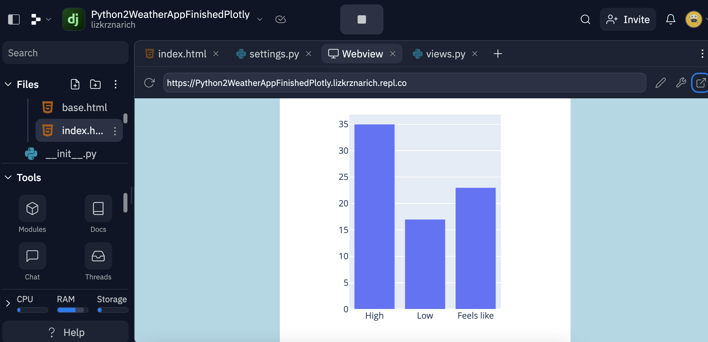

8. Let's update our **get_chart()** function to use dynamic data from the OpenWeather API. In **views.py**, we have an existing variable ```weather``` that contains the OpenWeather API response. Update your code to pass ```weather``` to ```get_chart()```.

        ...
        def get_chart(weather):
        ...
        chart = get_chart(weather)
        ...

9. In your **get_chart()** function, replace **temps** with the code below.

        temps = [
            weather['main']['temp_max'],
            weather['main']['temp_min'],
            weather['main']['feels_like']
        ]

10. After refreshing your **Webview**, you should see the chart updated with the dynamic values.

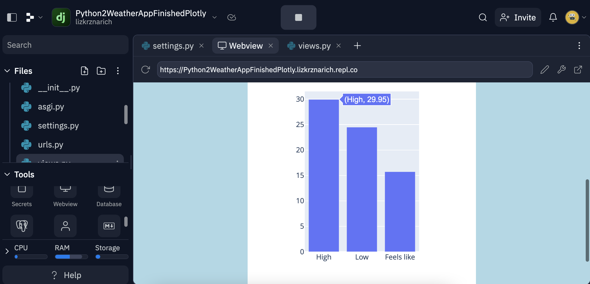

# Bonus activity: Add weather icons

Each OpenWeather API response includes a code for an icon that represents the current weather condition. You can get the image that corresponds to each code from OpenWeather and add display it in your application, along with the weather data. See the [Weather Icons documentation](https://openweathermap.org/weather-conditions)

Try adding the corresponding weather icon to your Django app!

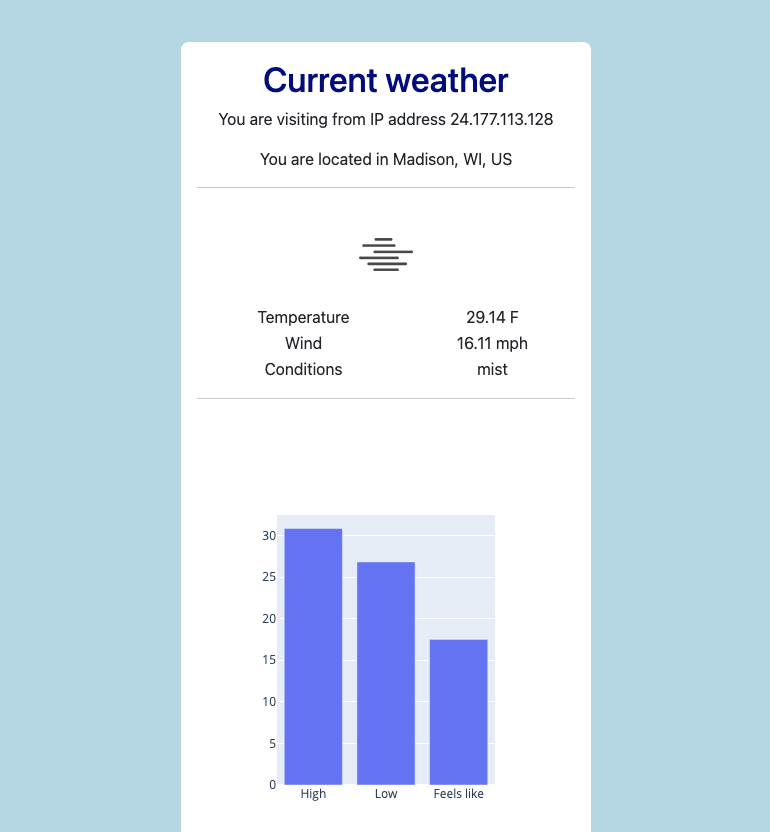


